# ChemistryQuantitativeAnalysisUI

[](https://github.com/yufongpeng/ChemistryQuantitativeAnalysisUI.jl/actions/workflows/CI.yml?query=branch%3Amaster)
[](https://codecov.io/gh/yufongpeng/ChemistryQuantitativeAnalysisUI.jl)

`ChemistryQuantitativeAnalysisUI.jl` provides user interfaces for [`ChemistryQuantitativeAnalysis.jl`](https://github.com/yufongpeng/ChemistryQuantitativeAnalysis.jl). 

This package can also be accessed through command line interfaces [`juliaquant`](https://github.com/yufongpeng/juliaquant).

## Interactively calibrate
Use `cal_ui!` on a `Batch` or a `.batch` repository.

Two windows will pop out. 
One is the main GUI.

Calibration curve settings, and the apearance can be modified through the interface.

Another is a table containing data for each points.
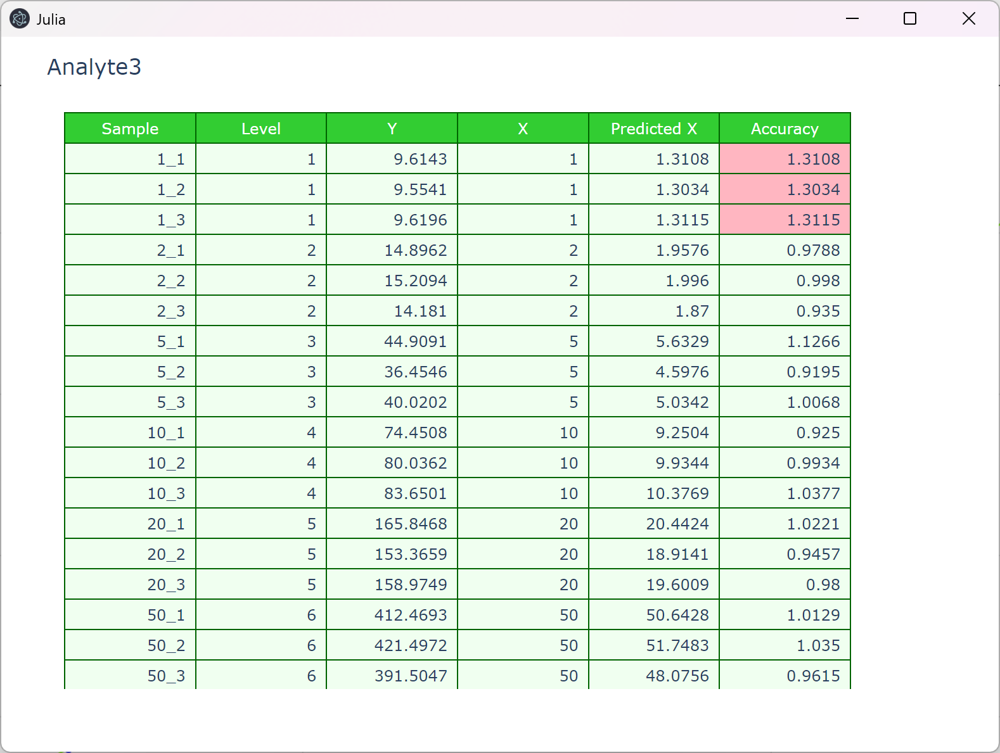
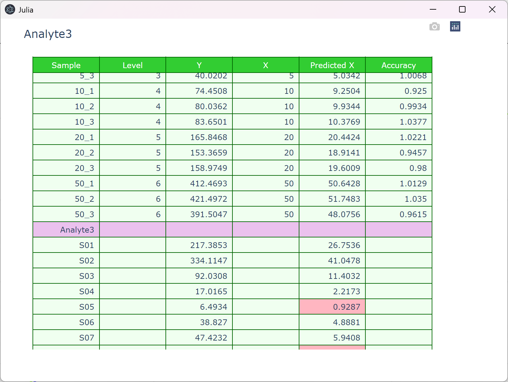
Pink values represent outliers, and dark green value means that it is deleted.

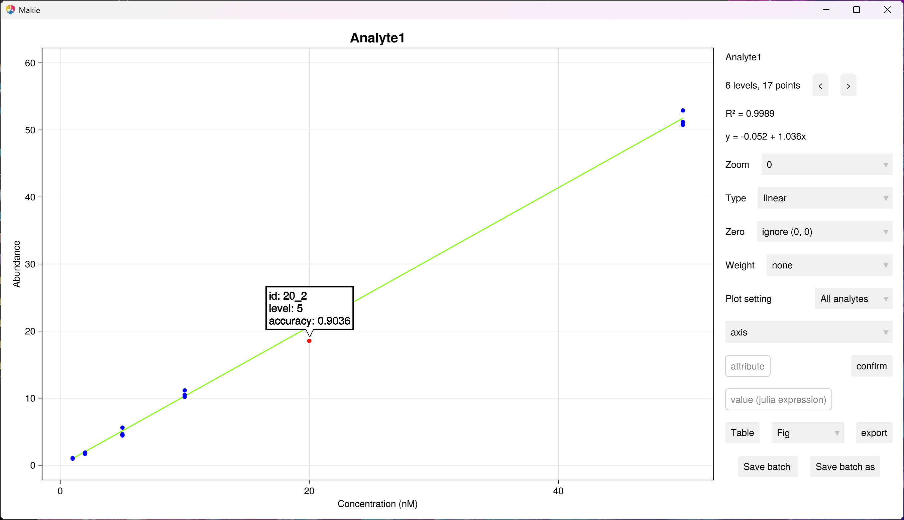
Calibration points can be deleted or added back by left click.

There are also widgets for various settings.

Next analyte:
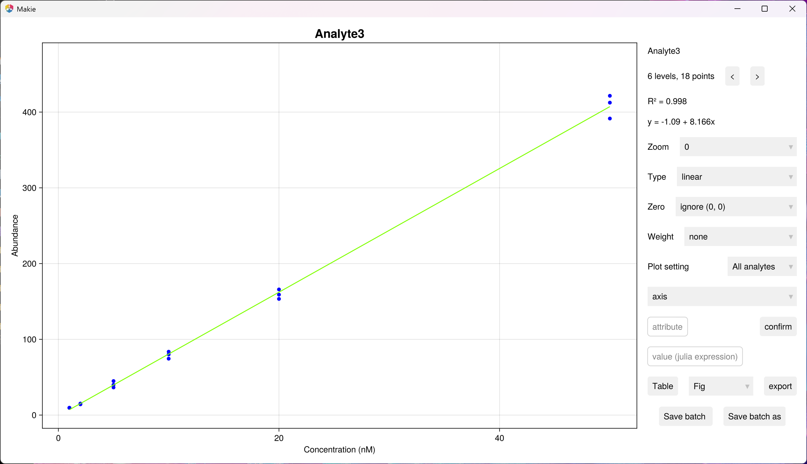

Zoom in specific calibration level:
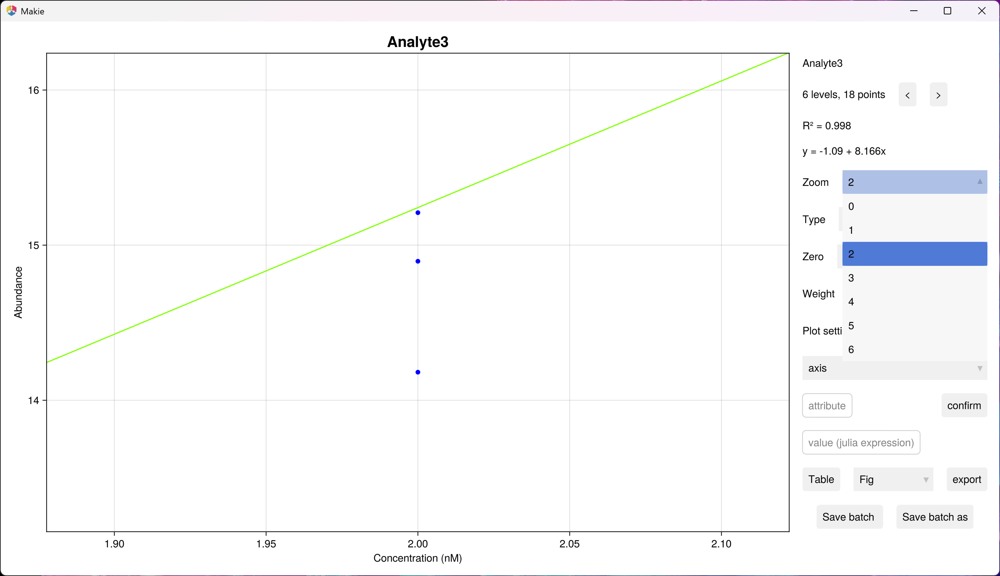
0 is moving back to original whole picture.

Change regression type:
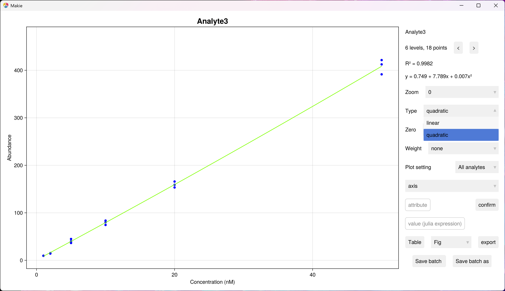

Zero point setting:


Weighting factor:
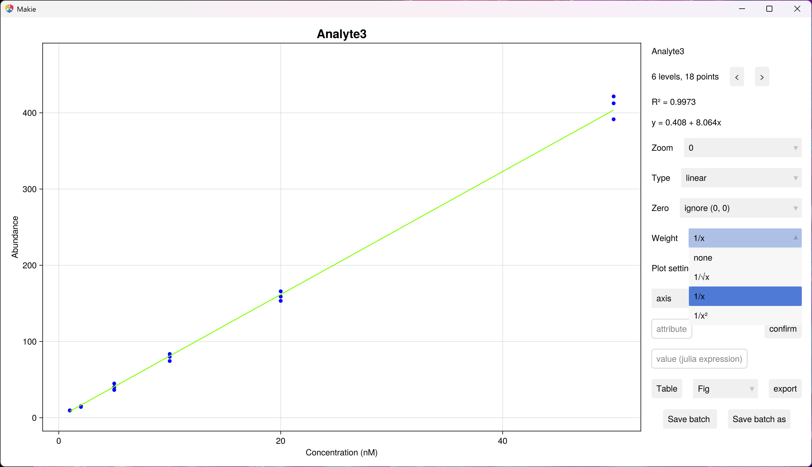

Plot setting:

Apply changes to axis of all plots.
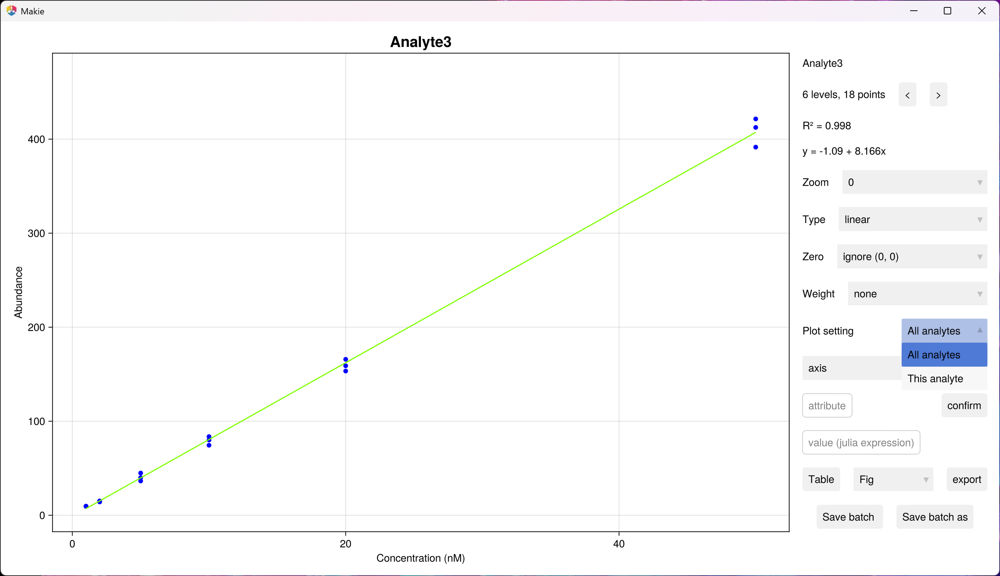
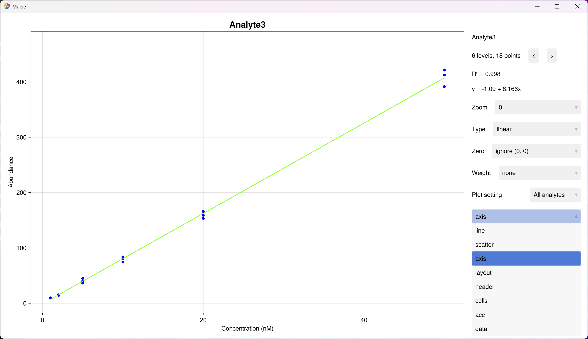
Change ylabel to "Signal"
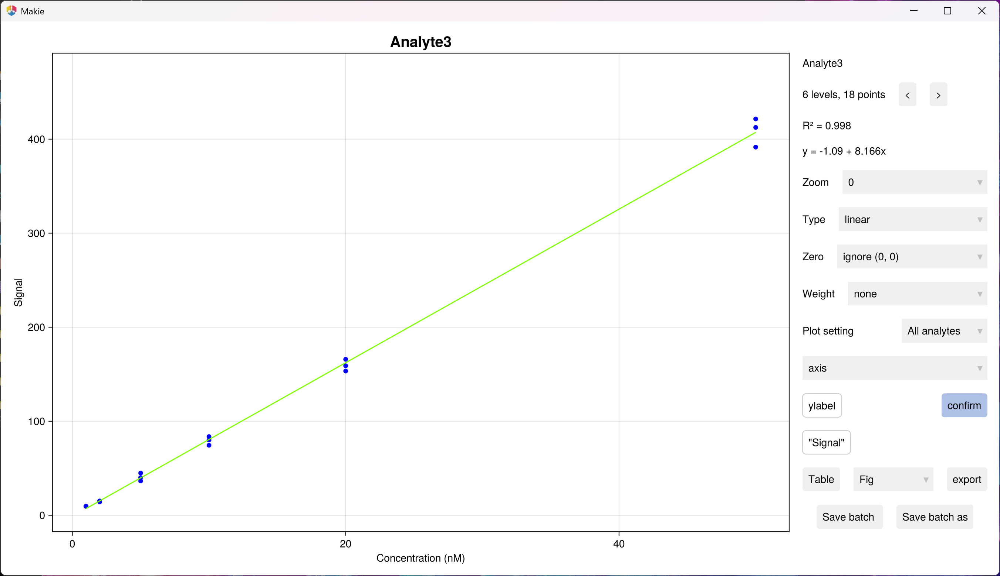
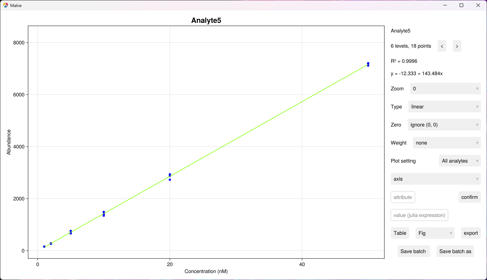
Please see documentation of [`Makie.jl`](https://docs.makie.org/v0.20/) for availabe attributes. Note that for scatter, a single value or a 2-element vector is valid. The latter represent values for selected (first) and unselected (second) points.
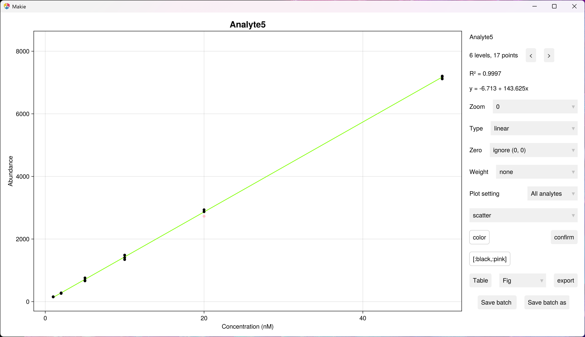

Open the table window:
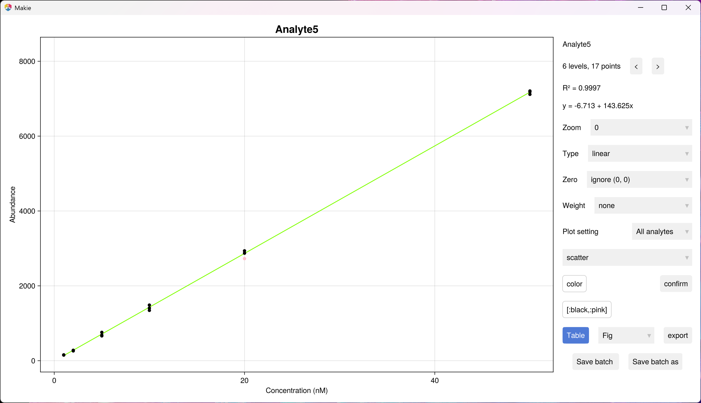

Export data:


Save batch:

The text changes to "Batch saved".
After some changes, the text changes back to "Save batch".

If the root directory is not ".batch", "Save batch" works as "Save batch as". 

Save batch as:


By default, this function blocks the calling task (REPL) until the gui is closed. To run it asynchronously, set keyword argument `async` true. To limit GUI opening time, set keyword argument `timeout`. For other keyword arguments, see documentation for `cal_ui!`.

### Attributes 
Attributes can be specified using attributes templates. The following is a built-in templates collection. 
```julia
TEMP_ATTR = [
    :acc_attr => Dict{Symbol, Any}(:lloq_multiplier => 4//3, :dev_acc => 0.15),
    :axis_attr => Dict{Symbol, Any}(
        :title => cal -> string(first(cal.analyte)), 
        :xlabel => "Concentration (nM)", 
        :ylabel => "Abundance", 
        :titlesize => 20
    ), 
    :cells_attr => Dict{Symbol, Any}(
        :height => 24, 
        :font => attr(size = 12), 
        :line_color => "darkgreen", 
        :align => :right, 
        :fill_color => ["honeydew", "lightpink", "darkseagreen"], 
        :subheader_color => "rgb(235, 193, 238)", 
        :sigdigits => [4, 4, 4, 4]
    ), 
    :data_attr => Dict{Symbol, Any}(
        :sigdigits => [4, 4, 4, 4],
        :digits => [nothing, nothing, nothing, nothing]
    ), 
    :fig_attr => Dict{Symbol, Any}(:size => (1350, 750)), 
    :header_attr => Dict{Symbol, Any}(
        :height => 24, 
        :font => attr(size = 12, color = "white"), 
        :values => ["Sample", "Level", "Y", "X", "Predicted X", "Accuracy"], 
        :line_color => "darkgreen", 
        :fill_color => "limegreen", 
        :align => "center"
    ), 
    :layout_attr => Dict{Symbol, Any}(
        :title => cal -> string(first(cal.analyte)), 
        :width => 720
    ), 
    :line_attr => Dict{Symbol, Any}(:color => :chartreuse),
    :scatter_attr => Dict{Symbol, Any}(
        :color => [:blue, :red], 
        :inspector_label => cal -> (self, i, p) -> string("id: ", cal.table.id[i], "\nlevel: ", cal.table.level[i], "\naccuracy: ", round(cal.table.accuracy[i]; sigdigits = 4))
    )
]
```


* `acc_attr`: definition of accuracy outliers.
    * `dev_acc`: allowed deviation of accuracy.
    * `lloq_multiplier`: multiplier of `dev_acc` for LLOQ level.
* `data_attr`: digits settings for showing value in main GUI or exporting data. They should be 4-element vectors representing formula, LLOQ, ULOQ and R².
    * `sigdigits`: number of siginificant digits.
    * `digits`: digits after or befor decimal.  
* `axis_attr`: attributes of `Axis`. Please see documentation of [`Makie.jl`](https://docs.makie.org/v0.20/).
* `fig_attr`: attributes of `Figure`. Please see documentation of [`Makie.jl`](https://docs.makie.org/v0.20/).
* `line_attr`: attributes of `Lines`. Please see documentation of [`Makie.jl`](https://docs.makie.org/v0.20/).
* `scatter_attr`: attributes of `Scatter`. Please see documentation of [`Makie.jl`](https://docs.makie.org/v0.20/). Note that a single value or a 2-element vector is valid. The latter represent values for selected (first) and unselected (second) points.
* `header_attr`: attributes of header of `Table`. Please see documentation of [`PlotlyJS`](https://plotly.com/javascript/reference/table/). There sre addtional attributes:
    * `subheader_color`: the color of subheader separating calibration points and sample values of each analyes.
    * `sigdigits`: number of siginificant digits.
    * `digits`: digits after or befor decimal.  
* `cells_attr`: attributes of cells of `Table`. Please see documentation of [`PlotlyJS`](https://plotly.com/javascript/reference/table/)
* `header_attr`: attributes of header of `Table`. Please see documentation of [`PlotlyJS`](https://plotly.com/javascript/reference/table/)
* `layout_attr`: attributes of `Layout`. Please see documentation of [`PlotlyJS`](https://plotly.com/javascript/reference/)

In template files, julia expression can be wrapped as `"@jl julia_expression"`, and string in the expression has to be chabged to `@q string...`. Reserved strings can be build from the corresponding characters. See [`attr_templates`](attr_templates). 

Users can also modify each json file in `calibration/*.mcal/attr/`. Julia expression in not allowed for these attributes files.
